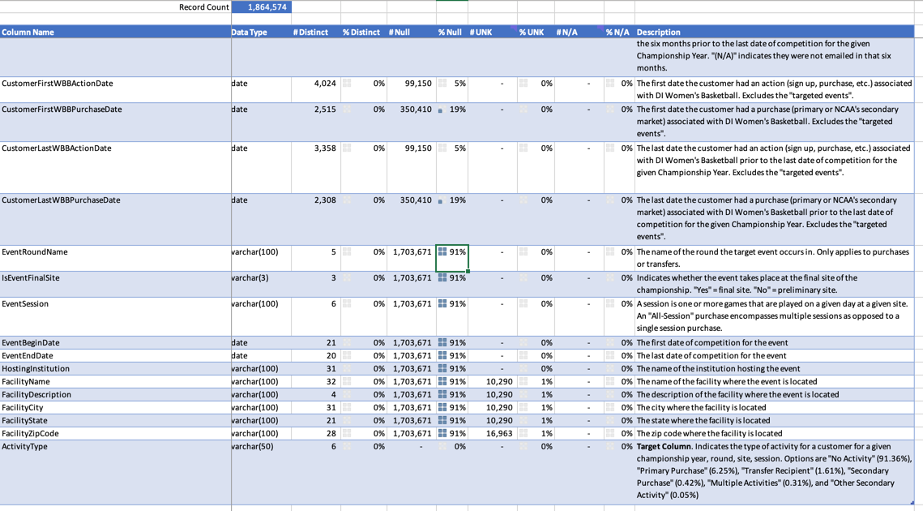

## CACC Championship Tickets Sales Prediction 
### Problem Description
- The NCAA orchestrates a dynamic landscape of sporting events, boasting 90 championships annually across three divisions and spanning over twenty sports. 
- Central to its mission is the strategic marketing and sale of tickets, a process fueled by insights gleaned from past and potential customers. 
- Project problem: how we can harness the wealth of data, coupled with external sources, to predict ticket purchases？

### Data Preprocessing
 What we have:
- a training set, test set, a submission template and data dictionary
- Prediction target: “ActivityType” column

 What the data files look like:
- Large data size (200k+)
- Lots of missing values
- Mixed variable types: numerical, categorial, etc.
- Difference between “UNK”, “NO” and “N/A”

 How we preprocess the data file:
1. Relationship investigation between purchase type and customer characteristics
- By sorting customers in different states, we can find some state has preferred purchase type (e.g., MA- primary purchase; SC-mixed purchase types, etc.), therefore, “FacilityState” and “FacilityZipCode” could be important variables.
- The two date variables: “EventBeginDate” and “EventBeginDate” are highly related to activity type is exist or no activity. 
- “EventRoundName”, “IsEventFinalSite”, “EventSession” are always has value if activity type exist and thus potentially functions as input variables.
- The “duration_WBBA” and “duration_WBBP” are created based on give data and used for determining the activity level of customers.
- Other columns with less Null are considered as input variables to avoid any possible missing of characteristics.
- Different purchase type are encoded as different integers for transformation convenience.
2. The final selected input variables (total 12 vars):
- Numerical vars = ['duration_WBBA', 'duration_WBBP', 'event_date_indicator’] 3 
- Categorical vars = ['IsCustomerInNCAAMembership', 'CustomerID’, 'HasCustomerClickedOrOpenedEmailsSixMonthsPrior', 'EventRoundName’,  'IsEventFinalSite', 'EventSession', 'HostingInstitution', 'FacilityState', 'FacilityZipCode’] 9

### Model Comparision
Different prediction model are tried including Logistic Regression, Decision Tree, Neural Network and Gradient boosting, the accuracy scores (training set) are:
- **Logistic Regression**: 0.91
- **Decision Tree**: 0.93
- **Neural Network**: 0.03
- **Gradient boosting**: 0.98

We decided to use **Gradient boosting** for test set, the final score we got is: **0.97963**

